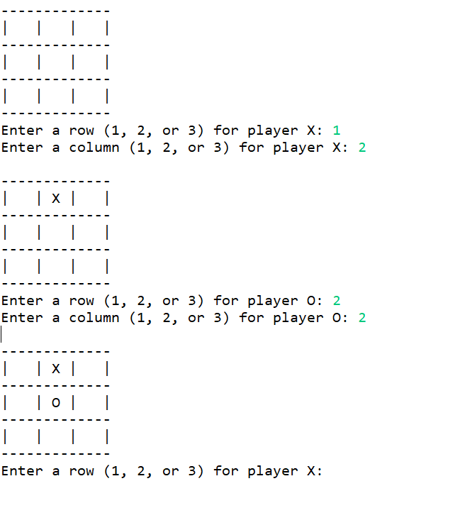

# Tic-Tac-Toe README

# Screenshot

# Description:
This is a program that will run the game Tic-tac-toe in the console and allow there to be two players. Each player will take turns choosing were to place their ‘X’ or ‘O’ until there is a winner or there is a draw. The player will input the row and column number to decide where to place their ‘X’ or  ‘O’. The program will check if the players move is valid before placing the players move. In all this is a fun Tic-Tac-Toe game to play with two players.

# Installation:
The program is a .java file so it can be run through the console. If ran through the console it must be compiled with javac TicTacToe.java , then ran with java TicTacToe.

# Technologies:
The Tic-Tac-Toe program is a Java only program and does not use any packages since the program is in one file. There is only one import which is the Scanner. 
